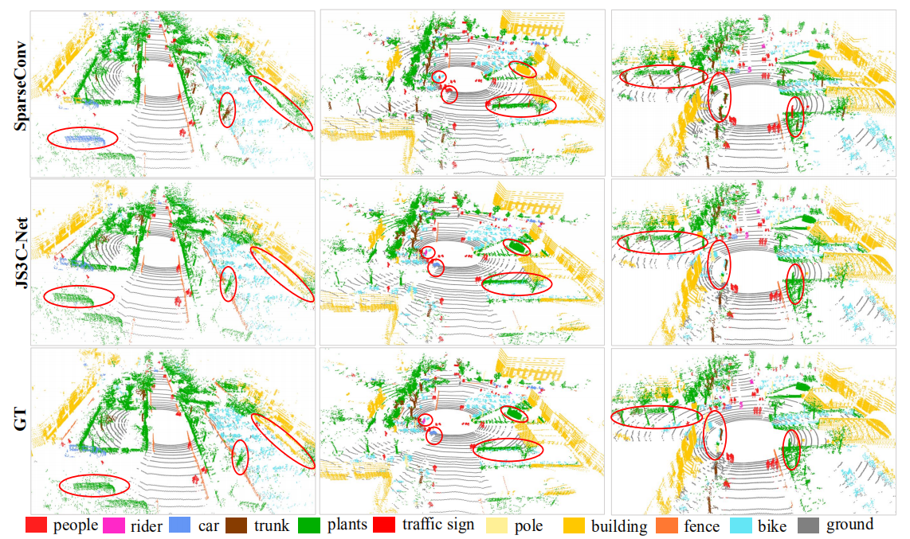
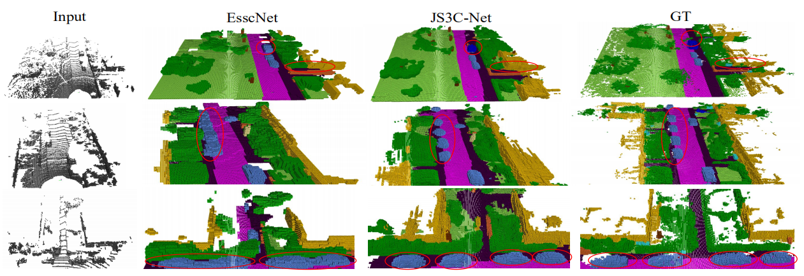
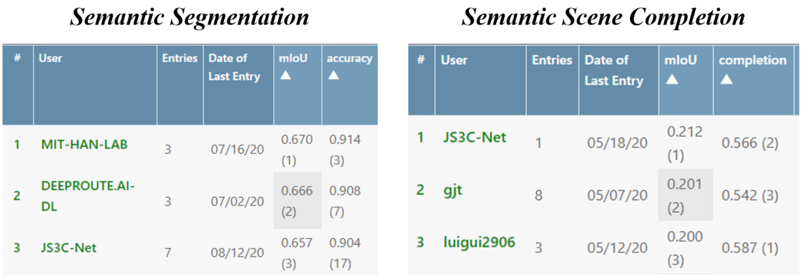

# JS3C-Net
### Sparse Single Sweep LiDAR Point Cloud Segmentation via Learning Contextual Shape Priors from Scene Completion (AAAI2021)
 
This repository is for **JS3C-Net** introduced in the following **AAAI-2021** paper [[arxiv paper]](https://arxiv.org/abs/2012.03762)

Xu Yan, Jiantao Gao, Jie Li, Ruimao Zhang, [Zhen Li*](https://mypage.cuhk.edu.cn/academics/lizhen/), Rui Huang and Shuguang Cui, "Sparse Single Sweep LiDAR Point Cloud Segmentation via Learning Contextual Shape Priors from Scene Completion".

* Semantic Segmentation:

* Semantic Scene Completion:


If you find our work useful in your research, please consider citing:
```
@InProceedings{yan2021sparse,
  title={Sparse Single Sweep LiDAR Point Cloud Segmentation via Learning Contextual Shape Priors from Scene Completion},
  author={Yan, Xu and Gao, Jiantao and Li, Jie and Zhang, Ruimao, and Li, Zhen and Huang, Rui and Cui, Shuguang},
  journal={AAAI Conference on Artificial Intelligence ({AAAI})},
  year={2021}
}
```


## Results on SemanticKITTI Benchmark
Quantitative results on SemanticKITTI benchmark at the submisison time.


## Comming Soon...
